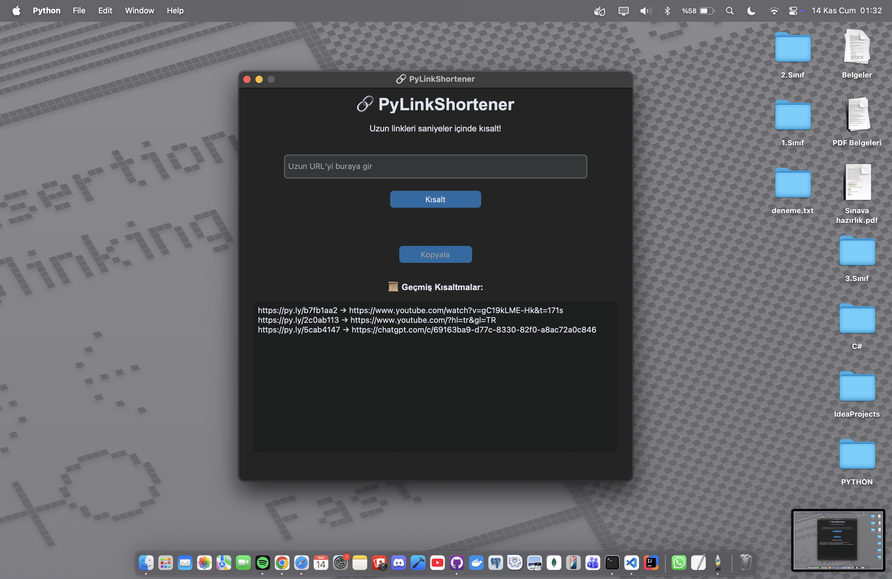
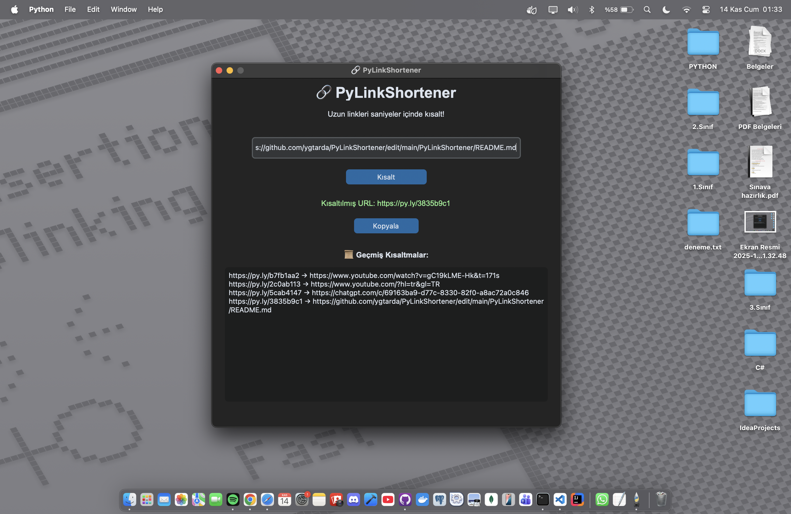
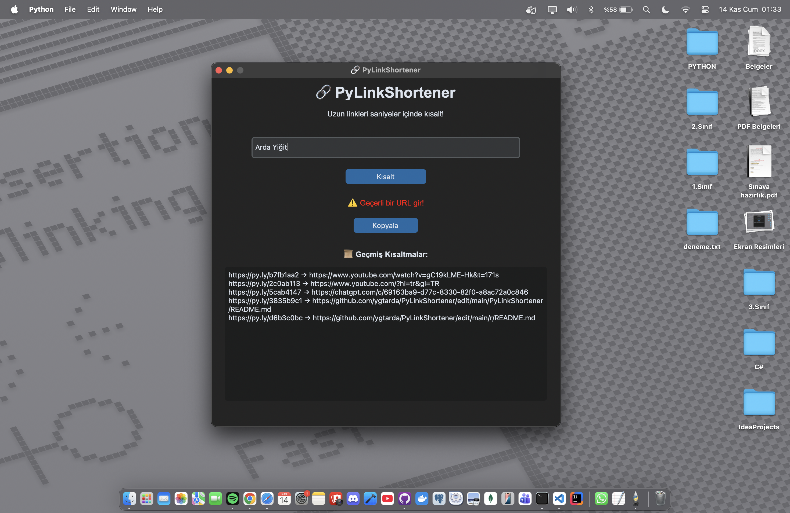

PyLinkShortener 🔗

**PyLinkShortener**, Python ve CustomTkinter ile yapılmış modern bir masaüstü URL kısaltıcı uygulamasıdır. Uzun linkleri saniyeler içinde kısaltır, panoya kopyalamanızı sağlar ve tüm kısaltma geçmişinizi yerel olarak kaydeder.

Geçmiş listesindeki linklere tıklayarak orijinal URL'yi tarayıcınızda açabilirsiniz.

## 📸 Ekran Görüntüleri

| Ana Arayüz | Kısaltma Başarılı | Geçersiz URL Hatası |
| :---: | :---: | :---: |
|  |  |  |


---

## 🎯 Temel Özellikler

* **Hızlı Kısaltma:** Uzun URL'leri anında kısaltır.
* **Panoya Kopyala:** Oluşturulan kısa linki tek tıkla panoya kopyalama butonu.
* **Tıklanabilir Geçmiş:** Tüm kısaltma geçmişi (kısa link -> orijinal link) tıklanabilir bir listede tutulur.
* **Kalıcı Kayıt:** Uygulama kapansa bile geçmiş linkler `JSON` dosyasında saklanır.
* **Modern Arayüz:** `CustomTkinter` kütüphanesi ile modern ve şık bir görünüm.
* **URL Doğrulama:** Geçersiz veya boş girişleri kontrol eder ve kullanıcıyı uyarır.

---

## 🖥️ Kullanılan Teknolojiler

* **Python 3.12**
* **CustomTkinter:** Modern GUI arayüzü için.
* **Pyperclip:** Panoya kopyalama işlemleri için.
* **Validators:** URL formatını doğrulamak için.
* **JSON:** Kısaltma geçmişini yerel olarak saklamak için.

---

## 🛠️ Kurulum ve Kullanım

### 1. Gereksinimler
* Python 3.10 veya daha yeni bir sürüm.

### 2. Kurulum
1.  Bu repoyu klonlayın veya ZIP olarak indirin:
    ```bash
    git clone [SENİN-GITHUB-REPO-URL'N]
    cd PyLinkShortener
    ```

2.  Bir sanal ortam (virtual environment) oluşturun ve aktifleştirin:

    *Windows:*
    ```bash
    python -m venv venv
    .\venv\Scripts\activate
    ```
    *macOS/Linux:*
    ```bash
    python3 -m venv venv
    source venv/bin/activate
    ```

3.  Gerekli paketleri `requirements.txt` dosyasından yükleyin:
    ```bash
    pip install -r requirements.txt
    ```

### 3. Çalıştırma
Uygulamayı başlatmak için `main.py` dosyasını çalıştırın:
```bash
python main.py


